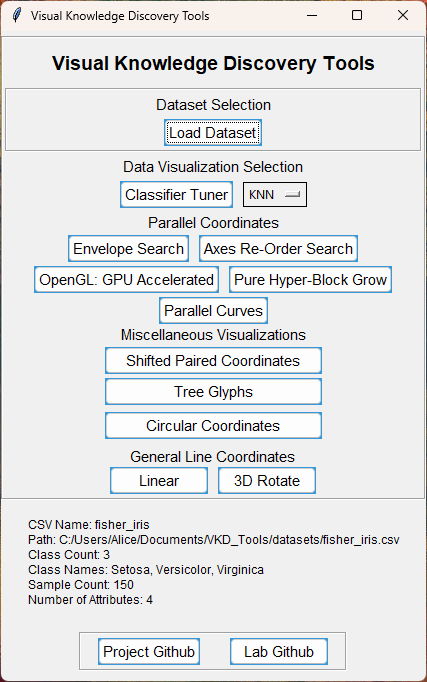
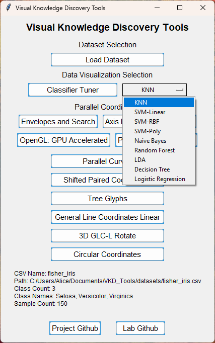
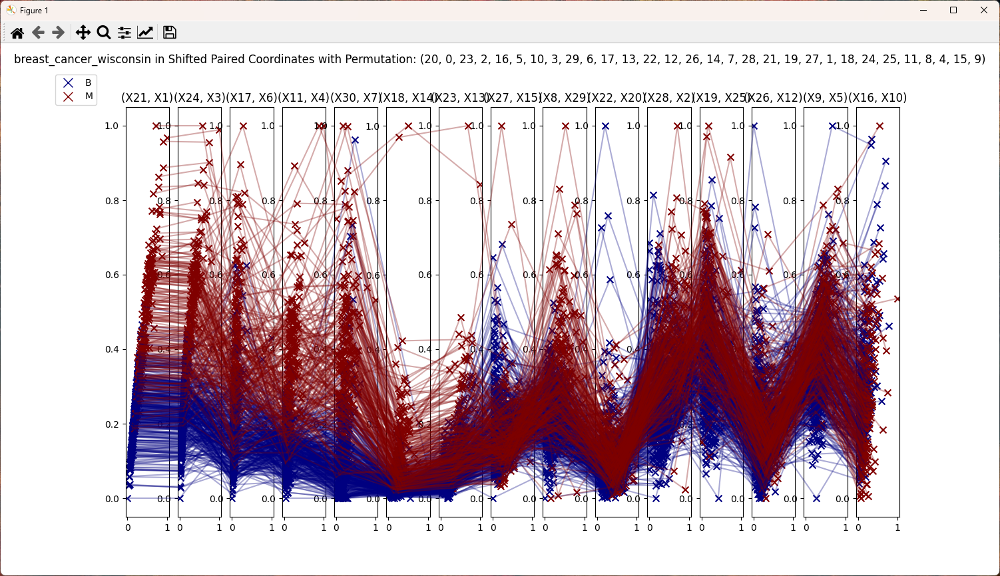
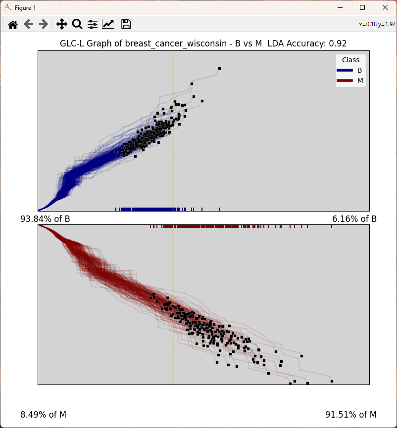

# VKD_Tools

## Overview

Tools made for visual knowledge discovery of multidimensional classification data.  
For visualizing, exploring, and identifying complex n-D data patterns.  

Get started by launching the `menu.py` script and loading a dataset.  
Datasets can be added to the datasets folder.  

- must have a column with header of 'class' for labels
- other columns assumed to be feature columns  
- top header row labels the 'class' and feature columns

Then, pick a visualization to explore, each visualization is described below.

## Libraries

These python libraries are required to run these scripts.

### Data Manipulation and Analysis

- pandas
- numpy
- scikit-learn

### Data Visualization

- matplotlib
- plotly
- PyOpenGL (optionally: pyopengl-accelerate, wheel)

### User Interface and System Interaction

- tkinter
- argparse
- subprocess
- webbrowser

### Main Menu Script

- menu.py: Provides a Tkinter-based graphical user interface as a main menu for launching the visualization scripts.

### Visualization Scripts

1. classifier_tuner.py: Tunes the hyperparameters of the selected classifier with a search through common options in 5-fold cross-validation.
    - Displays results as pair-wise scatterplots of attribute pairng matrix bottom-half.

    
    

2. envelope_plotter.py: Creates an interactive application for plotting envelope-like structures.
    - Utilizes PyQt6 for the graphical user interface.
    - Employs OpenGL for rendering graphical elements.
    - Drag and drop searchable hyper-rectangle with WASD resizing, right-click to clear.

    

3. plotly_demo.py: Focuses on data visualization using Plotly.
    - Plots the data in draggable axis parallel coordinates plot.
    - Distinctly displays classes with heatmap legend.

    

4. parallel_gl.py: Plots parallel coordinates in OpenGL using GPU pipelines.
    - Zoomable with mouse wheel, panning WIP.

    

5. shifted_paired.py: Generataes a shifted paired coordinates subplot sequence.
    - Plots all attributes of feature vectores as normalized paired axis.
    - Connects the feature vector samples with a line across subplots.
    - When feature vector is odd in length duplicates last attribute.
    - Mousewheel scrolls through permutations of the feature vector.
    - Displays Linear Discriminant Analysis resultant coefficient determined permutation first.

    

6. tree_glyph_plotter.py: Generates high-dimensional data visualization using tree-like glyphs.
    - Lossless visualization of high-dimensional data.
    - Plots a permutation of the feature vecture in tree glyphs.
    - Plotted permutation can be cycled with the mouse wheel.
    - Displays Linear Discriminant Analysis resultant coefficient determined permutation first.

    

7. glc_line_plotter.py: Generates GLC linear plot.
    - Displays first class on top subplot, other classes below.
    - Projects last glyph per class to x axis.
    - Processes data with Linear Discriminant Analysis and sorts by coefficient array.
    - Plots the LDA boundary with a yellow dotted line on x and y axis.
    - Uses GLC-AL algorithm to run a 100 epoch search for maximized accuracy of coefficients.

    

8. 3D GLC-L Rotation.
    - GLC-L: with additional z-axis using tan function.
    - SVM determined boundary border.

    

9. circular_plotter.py: Produces circular plots using Matplotlib and scikit-learn.
    - Processes data with Linear Discriminant Analysis and plots discriminant line.
    - Displays classification confusion matrix.
    - Handles data preprocessing using Pandas and NumPy.
    - Draggable LDA discriminant line.

    

---

### Aknowledgements

- CWU Visual Knowledge Discovery and Imaging Lab at <https://github.com/CWU-VKD-LAB>
