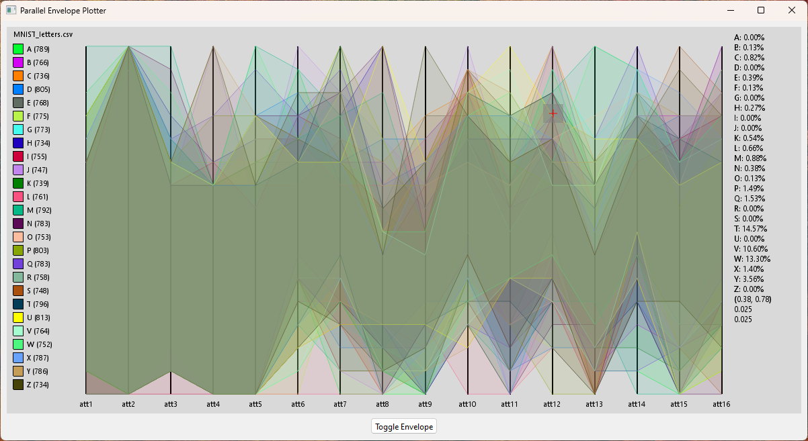
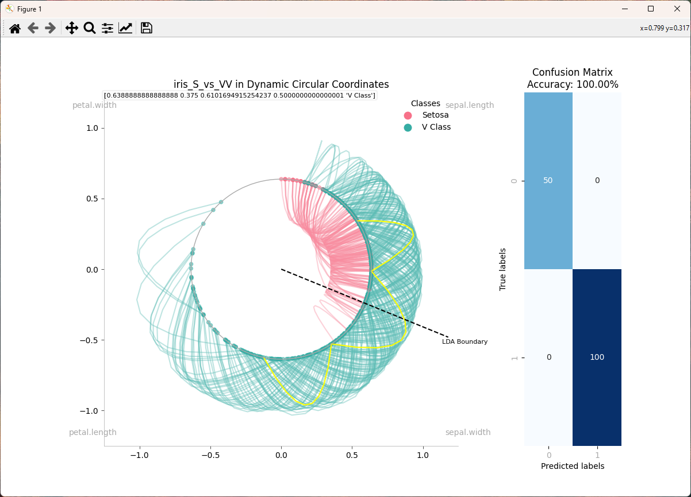
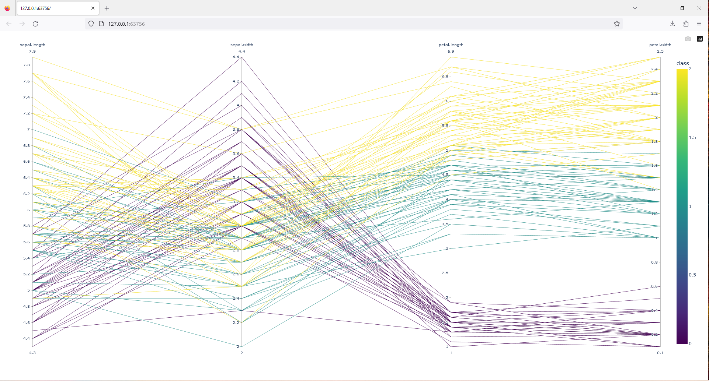

# VKD_Tools

Tools made for visual knowledge discovery of multidimensional classification data

## Overview

These scripts are designed for visualizing multi-dimensional data. All of them allow the user to select files for data input.

### Main Menu Script

- menu.py: Provides a Tkinter-based graphical user interface as a main menu for launching the visualization scripts.

### Visualization Scripts

1. envelope_plotter.py: Creates an interactive application for plotting envelope-like structures.
    - Utilizes PyQt6 for the graphical user interface.
    - Employs OpenGL for rendering graphical elements.  

    

2. circular_plotter.py: Produces circular plots using Matplotlib and scikit-learn.
    - Incorporates machine learning techniques like Linear Discriminant Analysis.
    - Handles data preprocessing using Pandas and NumPy.  

    

3. plotly_demo.py: Focuses on data visualization using Plotly.
    - Reads the selected data file using Pandas.
    - Creates visualizations with Plotly based on the imported data.  

    

4. 2d_glyph_plotter.py: Generates 2D polygonal glyphs.

    WIP images not accurate currently.

5. tree_glyph_plotter.py: Generates high-dimensional data visualization using tree-like glyphs.
    - Lossless visualization of high-dimensional data.
    - Plots a permutation subplot matrix and saves to png output files.

    

---

### Aknowledgements

- CWU Visual Knowledge Discovery and Imaging Lab at <https://github.com/CWU-VKD-LAB>
